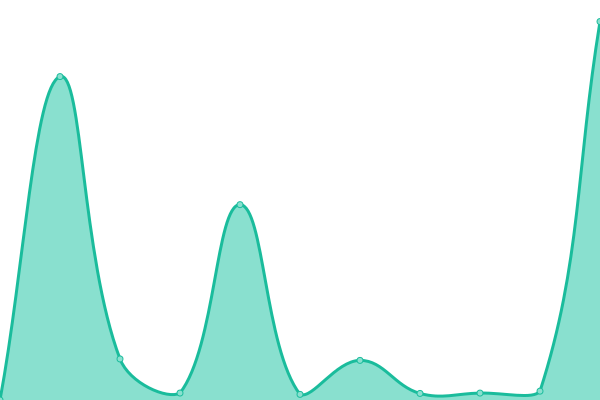

# [📈 Live Status](https://orangemn6.github.io/uptime-monitor): <!--live status--> **🟩 All systems operational**

This repository contains the open-source uptime monitor and status page for [orangemn6](https://orangemn6.xyz), powered by [Upptime](https://github.com/upptime/upptime).

With [Upptime](https://upptime.js.org), you can get your own unlimited and free uptime monitor and status page, powered entirely by a GitHub repository. We use [Issues](https://github.com/orangemn6/uptime-monitor/issues) as incident reports, [Actions](https://github.com/orangemn6/uptime-monitor/actions) as uptime monitors, and [Pages](https://orangemn6.github.io/uptime-monitor) for the status page.

<!--start: status pages-->
<!-- This summary is generated by Upptime (https://github.com/upptime/upptime) -->
<!-- Do not edit this manually, your changes will be overwritten -->
<!-- prettier-ignore -->
| URL | Status | History | Response Time | Uptime |
| --- | ------ | ------- | ------------- | ------ |
|  [OrangeBin](https://bin.orangemn6.xyz) | 🟩 Up | [orange-bin.yml](https://github.com/orangemn6/uptime-monitor/commits/HEAD/history/orange-bin.yml) | 

 937ms
     
 | 

<a href="https://status.orangemn6.xyz/history/orange-bin">88.05%</a>
    

|  [The Epic Proxy that too many people use](https://68656e647279646564.cf/) | 🟩 Up | [the-epic-proxy-that-too-many-people-use.yml](https://github.com/orangemn6/uptime-monitor/commits/HEAD/history/the-epic-proxy-that-too-many-people-use.yml) | 

 1194ms
     
 | 

<a href="https://status.orangemn6.xyz/history/the-epic-proxy-that-too-many-people-use">89.35%</a>
    

|  [OrangeChat](https://chat.orangemn6.xyz) | 🟩 Up | [orange-chat.yml](https://github.com/orangemn6/uptime-monitor/commits/HEAD/history/orange-chat.yml) | 

 2167ms
     
 | 

<a href="https://status.orangemn6.xyz/history/orange-chat">96.63%</a>
    

|  [OS in Browser](https://genow.cf) | 🟩 Up | [os-in-browser.yml](https://github.com/orangemn6/uptime-monitor/commits/HEAD/history/os-in-browser.yml) | 

 0ms
     
 | 

<a href="https://status.orangemn6.xyz/history/os-in-browser">100.00%</a>
    

|  [Ryans porxy](https://ryanlovesschool.gq) | 🟩 Up | [ryans-porxy.yml](https://github.com/orangemn6/uptime-monitor/commits/HEAD/history/ryans-porxy.yml) | 

 1113ms
     
 | 

<a href="https://status.orangemn6.xyz/history/ryans-porxy">98.64%</a>
    

<!--end: status pages-->

[**Visit our status website →**](https://orangemn6.github.io/uptime-monitor)

## 📄 License

- Powered by: [Upptime](https://github.com/upptime/upptime) the amazing monitor
- Code: [MIT](./LICENSE) © [orangemn6](https://orangemn6.xyz)
- Data in the `./history` directory: [Open Database License](https://opendatacommons.org/licenses/odbl/1-0/)
